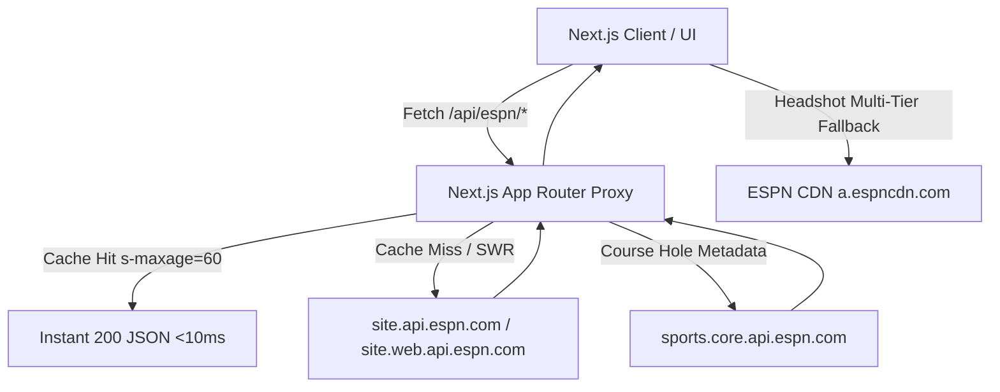
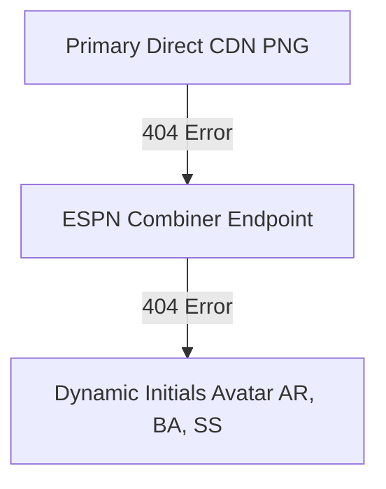

# ESPN PGA Golf API Reference & OpenAPI / Swagger Specification

This document provides a comprehensive developer specification, OpenAPI (Swagger) reference, payload schemas, integration architecture, and battle-tested gotchas for integrating live PGA Tour golf data via the ESPN public endpoints and proxy routes.

---

## 📑 Table of Contents
1. [Architecture Overview & Proxy Pipeline](#-architecture-overview--proxy-pipeline)
2. [OpenAPI 3.0+ / Swagger Specification](#-openapi-30--swagger-specification)
3. [Primary Endpoints Deep Dive](#-primary-endpoints-deep-dive)
   - [Scoreboard & Tournament Calendar (`/apis/site/v2/sports/golf/pga/scoreboard`)](#1-scoreboard--tournament-calendar)
   - [Tournament Leaderboard (`/apis/site/v2/sports/golf/leaderboard`)](#2-tournament-leaderboard)
   - [Player Summary & Hole-by-Hole Scorecard (`/apis/site/v2/sports/golf/pga/leaderboard/{eventId}/playersummary`)](#3-player-summary--hole-by-hole-scorecard)
   - [Core Event & Course Info (`/v2/sports/golf/leagues/pga/events/{eventId}`)](#4-core-event--course-details)
4. [Data Schemas & Type Definitions](#-data-schemas--type-definitions)
   - [ESPNCompetitor & Score Structures](#espncompetitor--score-structures)
   - [18-Hole Linescores & Score Badges](#18-hole-linescores--score-badges)
   - [Player Status & Cut Detection Rules](#-player-status--cut-detection-rules)
5. [Headshot Image & CDN Architecture](#-headshot-image--cdn-architecture)
6. [Caching & Performance Best Practices](#-caching--performance-best-practices)
7. [PGA Tour Authentic Player Directory](#-pga-tour-authentic-player-directory)

---

## 🏛 Architecture Overview & Proxy Pipeline



### Why Proxy Through Next.js API Routes?
1. **CORS & Rate-Limit Shielding**: Direct browser requests to ESPN endpoints may trigger CORS restrictions or aggressive rate limits.
2. **Server-Side SWR Caching**: Routes set `Cache-Control: public, s-maxage=60, stale-while-revalidate=120`, caching responses at the edge / server.
3. **Data Enrichment & Composite Fetching**: E.g., `api/espn/playersummary` queries both the `playersummary` endpoint and the core event endpoint in parallel to attach official course hole par layouts (`shotsToPar`).

---

## 📋 OpenAPI 3.0 / Swagger Specification

Below is the OpenAPI 3.0.3 specification covering both the upstream ESPN endpoints and our Next.js App Router proxy endpoints.

```yaml
openapi: 3.0.3
info:
  title: ESPN Golf PGA API & Proxy Service
  version: 2.0.0
  description: >
    Official reverse-engineered specification for ESPN PGA Golf live scoreboard,
    leaderboard, player summary, course hole metadata, and local proxy endpoints.
servers:
  - url: https://site.api.espn.com/apis/site/v2/sports/golf/pga
    description: Primary Public ESPN Golf Site API
  - url: https://site.web.api.espn.com/apis/site/v2/sports/golf
    description: Web Leaderboard & Player Summary API
  - url: https://sports.core.api.espn.com/v2/sports/golf/leagues/pga
    description: Core Golf Entity & Course Data API
  - url: /api/espn
    description: Local Next.js Application Proxy Layer

paths:
  /scoreboard:
    get:
      summary: Get PGA Scoreboard & Tour Calendar
      description: Returns the current active tournament scoreboard, leagues calendar, and competitor standings.
      parameters:
        - name: event
          in: query
          required: false
          schema:
            type: string
          description: Specific event ID (optional). If omitted, returns current in-season active event.
      responses:
        '200':
          description: Scoreboard payload with active tournaments and full season calendar.
          content:
            application/json:
              schema:
                $ref: '#/components/schemas/ESPNScoreboardResponse'

  /leaderboard:
    get:
      summary: Get Tournament Leaderboard & Full Competitor Field
      description: Returns full field competitor scores, linescores, rankings, and athlete metadata for a specific tournament.
      parameters:
        - name: event
          in: query
          required: true
          schema:
            type: string
          description: Tournament event ID (e.g., '401703467' or '401580354')
      responses:
        '200':
          description: Full tournament field leaderboard.
          content:
            application/json:
              schema:
                $ref: '#/components/schemas/ESPNLeaderboardResponse'

  /leaderboard/{eventId}/playersummary:
    get:
      summary: Get Player Round-by-Round & Hole-by-Hole Scorecard
      description: Returns hole-by-hole scores, par differentials, statistics, and biography for a single player in a tournament.
      parameters:
        - name: eventId
          in: path
          required: true
          schema:
            type: string
          description: Tournament event ID
        - name: player
          in: query
          required: true
          schema:
            type: string
          description: ESPN athlete ID (e.g., '3470' for Rory McIlroy, '9478' for Scottie Scheffler)
        - name: season
          in: query
          required: false
          schema:
            type: string
            example: '2026'
          description: Tour season year
      responses:
        '200':
          description: Player summary scorecard.
          content:
            application/json:
              schema:
                $ref: '#/components/schemas/ESPNPlayerSummaryResponse'

  /events/{eventId}:
    get:
      summary: Core Event & Course Details
      description: Returns deep metadata for an event including course hole par setups and yards.
      parameters:
        - name: eventId
          in: path
          required: true
          schema:
            type: string
      responses:
        '200':
          description: Core event metadata including courses array and hole pars.

components:
  schemas:
    ESPNScoreboardResponse:
      type: object
      properties:
        leagues:
          type: array
          items:
            type: object
            properties:
              id:
                type: string
              name:
                type: string
              calendar:
                type: array
                items:
                  $ref: '#/components/schemas/ESPNCalendarItem'
        events:
          type: array
          items:
            $ref: '#/components/schemas/ESPNEvent'

    ESPNLeaderboardResponse:
      type: object
      properties:
        id:
          type: string
        name:
          type: string
        status:
          $ref: '#/components/schemas/ESPNEventStatus'
        events:
          type: array
          items:
            $ref: '#/components/schemas/ESPNEvent'

    ESPNEvent:
      type: object
      properties:
        id:
          type: string
        name:
          type: string
        shortName:
          type: string
        date:
          type: string
          format: date-time
        endDate:
          type: string
          format: date-time
        status:
          $ref: '#/components/schemas/ESPNEventStatus'
        courses:
          type: array
          items:
            $ref: '#/components/schemas/ESPNCourse'
        competitions:
          type: array
          items:
            $ref: '#/components/schemas/ESPNCompetition'

    ESPNEventStatus:
      type: object
      properties:
        period:
          type: integer
          description: Current round (1-4)
        type:
          type: object
          properties:
            id:
              type: string
            name:
              type: string
              enum: [STATUS_SCHEDULED, STATUS_IN_PROGRESS, STATUS_HALTED, STATUS_FINAL, STATUS_PLAYOFF]
            state:
              type: string
              enum: [pre, in, post]
            completed:
              type: boolean
            description:
              type: string
            detail:
              type: string
            shortDetail:
              type: string

    ESPNCalendarItem:
      type: object
      properties:
        id:
          type: string
        label:
          type: string
        startDate:
          type: string
          format: date-time
        endDate:
          type: string
          format: date-time

    ESPNCourse:
      type: object
      properties:
        id:
          type: string
        name:
          type: string
        city:
          type: string
        state:
          type: string
        shotsToPar:
          type: integer
          example: 72
        holes:
          type: array
          items:
            type: object
            properties:
              number:
                type: integer
              shotsToPar:
                type: integer

    ESPNCompetition:
      type: object
      properties:
        id:
          type: string
        competitors:
          type: array
          items:
            $ref: '#/components/schemas/ESPNCompetitor'

    ESPNCompetitor:
      type: object
      properties:
        id:
          type: string
        order:
          type: integer
        status:
          type: object
          nullable: true
          description: Null or empty for missed cuts
          properties:
            period:
              type: integer
            thru:
              type: integer
            displayValue:
              type: string
            position:
              type: object
              properties:
                displayName:
                  type: string
                isTie:
                  type: boolean
        score:
          oneOf:
            - type: string
            - type: number
            - type: object
              properties:
                displayValue:
                  type: string
                value:
                  type: number
        athlete:
          $ref: '#/components/schemas/ESPNAthlete'
        linescores:
          type: array
          items:
            $ref: '#/components/schemas/ESPNRoundLinescore'

    ESPNAthlete:
      type: object
      properties:
        id:
          type: string
        displayName:
          type: string
        shortName:
          type: string
        flag:
          type: object
          properties:
            href:
              type: string
            alt:
              type: string
        headshot:
          type: object
          properties:
            href:
              type: string
        country:
          type: object
          properties:
            abbreviation:
              type: string

    ESPNRoundLinescore:
      type: object
      properties:
        period:
          type: integer
          description: Round number (1-4)
        value:
          type: number
          description: Total strokes for this round
        displayValue:
          type: string
          description: Score relative to par (e.g., "-4", "E", "+2")
        linescores:
          type: array
          items:
            $ref: '#/components/schemas/ESPNHoleLinescore'

    ESPNHoleLinescore:
      type: object
      properties:
        period:
          type: integer
          description: Hole number (1-18)
        value:
          type: number
          description: Strokes on this hole
        scoreType:
          type: object
          properties:
            displayValue:
              type: string
              description: Score diff to par ("-1" Birdie, "0" Par, "+1" Bogey, "-2" Eagle)

    ESPNPlayerSummaryResponse:
      type: object
      properties:
        profile:
          type: object
          properties:
            id:
              type: string
            displayName:
              type: string
        rounds:
          type: array
          items:
            $ref: '#/components/schemas/ESPNRoundLinescore'
        stats:
          type: array
          items:
            type: object
            properties:
              name:
                type: string
              displayValue:
                type: string
        courseHoles:
          type: array
          items:
            type: integer
          description: Attached by proxy from core event data
        courseName:
          type: string
        shotsToPar:
          type: integer
```

---

## 📍 Primary Endpoints Deep Dive

### 1. Scoreboard & Tournament Calendar
* **Upstream**: `GET https://site.api.espn.com/apis/site/v2/sports/golf/pga/scoreboard`
* **Proxy**: `GET /api/espn/scoreboard`
* **Query Parameters**:
  - `event={eventId}` (Optional: fetches specific tournament; defaults to active PGA event)

#### Key Payload Paths:
- **Active Event**: `data.events[0]`
- **Full Season Calendar**: `data.leagues[0].calendar` (Array of all tour events across season)
- **Competitors**: `data.events[0].competitions[0].competitors`

---

### 2. Tournament Leaderboard
* **Upstream**: `GET https://site.web.api.espn.com/apis/site/v2/sports/golf/leaderboard?event={eventId}`
* **Proxy**: `GET /api/espn/leaderboard?event={eventId}`
* **Parameters**:
  - `event` (Required): ESPN event ID

#### Key Payload Paths:
- `data.events[0].competitions[0].competitors` (140+ golfers with live linescores and statuses)
- `data.events[0].status` (Event progress: `pre`, `in`, `post`, round number `period`)

---

### 3. Player Summary & Hole-by-Hole Scorecard
* **Upstream**: `GET https://site.web.api.espn.com/apis/site/v2/sports/golf/pga/leaderboard/{eventId}/playersummary?season={year}&player={playerId}`
* **Proxy**: `GET /api/espn/playersummary?eventId={eventId}&playerId={playerId}&season={year}`

#### Key Payload Paths:
- `data.rounds` — Array of round objects containing 18-hole `linescores`
- `data.profile` — Athlete bio
- `data.stats` — Driving distance, GIR, putts per round stats

> [!CAUTION]
> **`data.competitor` is NOT present in the upstream response.**
> ESPN returns only `{ profile, rounds, stats }`. Do NOT attempt to read `playerSummary.competitor` for CUT/WD detection. Always pass the competitor object from the leaderboard endpoint.

---

### 4. Core Event & Course Details
* **Upstream**: `GET https://sports.core.api.espn.com/v2/sports/golf/leagues/pga/events/{eventId}`
* **Payload Highlights**:
  - `courses[0].name` (Course name, e.g. "Torrey Pines Golf Course")
  - `courses[0].shotsToPar` (Course par, e.g. 72)
  - `courses[0].holes` (Array with `number` and `shotsToPar` for all 18 holes)

---

## ⛳ Data Schemas & Type Definitions

### ESPNCompetitor & Score Structures

```typescript
export interface ESPNCompetitor {
  id: string;
  order: number;         // Rank order (1 = leader)
  score?: string | number | { displayValue?: string; value?: number };
  status?: {
    period?: number;     // Current round (1-4)
    thru?: number;       // Holes completed in current round (1-18, 18 = 'F')
    displayValue?: string;
    position?: {
      displayName?: string; // "1", "T2", "T15"
      isTie?: boolean;
    };
    type?: {
      name?: string;     // 'STATUS_SCHEDULED', 'STATUS_IN_PROGRESS', 'STATUS_FINAL'
      state?: string;    // 'pre', 'in', 'post'
      completed?: boolean;
    };
  };
  athlete: {
    id: string;
    displayName: string;
    shortName?: string;
    headshot?: { href: string };
    flag?: { href: string; alt?: string };
    country?: { abbreviation?: string };
  };
  linescores?: ESPNRoundLinescore[];
}
```

---

## ✂️ Player Status & Cut Detection Rules

> [!CAUTION]
> **ESPN sends `null` or an empty status object for players who miss the 36-hole cut.**
> Any string search on `status.position.displayName === 'CUT'` will **fail**.

### Authoritative Rule: `linescores.length`

| `linescores.length` | Event Status | Status Determination |
|---|---|---|
| `2` | Round >= 3 or Post/Final | **CUT** (Missed 36-hole cut) |
| `4` | Post / Final | **Active / Finished all 4 rounds** |
| Any | `status.type.name === 'STATUS_WD'` or `position.displayName === 'WD'` | **WD** (Withdrawn) |
| Any | `status.type.name === 'STATUS_DQ'` or `position.displayName === 'DQ'` | **DQ** (Disqualified) |
| `1` | `position.displayName === '1'` & `eventStatus.completed` | **WINNER** |

### Implementation Pattern:
```typescript
export function getPlayerStatusInfo(comp: ESPNCompetitor, eventStatus?: any): PlayerStatusInfo {
  if (!comp) return { isCut: false, isWD: false, isDQ: false, isMDF: false, isInactive: false, statusText: '-' };

  const isFinalOrLateRound =
    eventStatus?.type?.state === 'post' ||
    eventStatus?.type?.completed === true ||
    (eventStatus?.period ?? 0) >= 3;

  const missedCutByRounds =
    isFinalOrLateRound &&
    Array.isArray(comp.linescores) &&
    comp.linescores.length === 2;

  const rawPosition = comp.status?.position?.displayName?.toUpperCase() || '';
  const isWD = rawPosition === 'WD' || comp.status?.type?.name?.includes('WD');
  const isDQ = rawPosition === 'DQ' || comp.status?.type?.name?.includes('DQ');
  const isCut = missedCutByRounds || rawPosition === 'CUT' || rawPosition === 'MC';

  return {
    isCut,
    isWD,
    isDQ,
    isMDF: rawPosition === 'MDF',
    isInactive: isCut || isWD || isDQ,
    statusText: isCut ? 'CUT' : isWD ? 'WD' : isDQ ? 'DQ' : comp.status?.displayValue || '-'
  };
}
```

---

## 🖼️ Headshot Image & CDN Architecture

### Fallback Hierarchy
Direct ESPN CDN PNGs may return 404 for unranked or newly added golfers. The system applies a 3-tier loading strategy:



1. **Stage 1 (Primary Direct CDN)**:
   ```
   https://a.espncdn.com/i/headshots/golf/players/full/{playerId}.png
   ```
2. **Stage 2 (ESPN Combiner Endpoint)**:
   ```
   https://a.espncdn.com/combiner/i?img=/i/headshots/golf/players/full/{playerId}.png&w=120&h=120&scale=crop
   ```
3. **Stage 3 (Styled Text Initials Avatar)**:
   Renders golfer's initials (`SS`, `RM`, `XS`) on dark gradient badge.

### Next.js Image `unoptimized` Directive
Always include `unoptimized={true}` when rendering external ESPN CDN images to prevent server proxy failures:
```tsx
<Image
  src={headshotUrl}
  alt={displayName}
  unoptimized={true}
  width={48}
  height={48}
/>
```

---

## 🚀 Caching & Performance Best Practices

```typescript
// Proxy Route Caching Header
export const dynamic = 'force-dynamic';

export async function GET() {
  return NextResponse.json(data, {
    headers: {
      'Cache-Control': 'public, s-maxage=60, stale-while-revalidate=120',
      'CDN-Cache-Control': 'public, s-maxage=60',
    },
  });
}
```

- **`s-maxage=60`**: Edge CDN caches fresh scores for 60 seconds.
- **`stale-while-revalidate=120`**: Serves stale content instantaneously while revalidating asynchronously in background.

---

## 📇 PGA Tour Authentic Player Directory

Stored in `src/lib/espn/espnPlayerDirectory.json`, mapping **279+ active PGA Tour golfers** to their verified ESPN athlete IDs:

| Player Name | ESPN ID | Direct CDN Headshot |
|---|---|---|
| **Scottie Scheffler** | `9478` | `https://a.espncdn.com/i/headshots/golf/players/full/9478.png` |
| **Rory McIlroy** | `3470` | `https://a.espncdn.com/i/headshots/golf/players/full/3470.png` |
| **Xander Schauffele** | `10140` | `https://a.espncdn.com/i/headshots/golf/players/full/10140.png` |
| **Collin Morikawa** | `10592` | `https://a.espncdn.com/i/headshots/golf/players/full/10592.png` |
| **Ludvig Åberg** | `4692764` | `https://a.espncdn.com/i/headshots/golf/players/full/4692764.png` |
| **Viktor Hovland** | `10593` | `https://a.espncdn.com/i/headshots/golf/players/full/10593.png` |
| **Justin Thomas** | `4848` | `https://a.espncdn.com/i/headshots/golf/players/full/4848.png` |
| **Max Homa** | `8974` | `https://a.espncdn.com/i/headshots/golf/players/full/8974.png` |
| **Tommy Fleetwood** | `5539` | `https://a.espncdn.com/i/headshots/golf/players/full/5539.png` |
| **Aaron Rai** | `10906` | `https://a.espncdn.com/i/headshots/golf/players/full/10906.png` |
